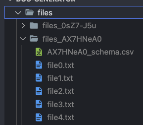

# doc-generator

utility for generating fake training documents and accompanying csv input file

1. Make a .env file in the root of the project and add the following line

```.env
BUCKET_PATH_STRING = "gs://cloud-ai-platform-{{your-bucket-path-here}}";
```

2. run this command to generate a new set of documents and csv file.  You will find it all in a directory with a unique name for each batch, under `files/`.

```bash
node docMaker.js
```

so you will end up with...

