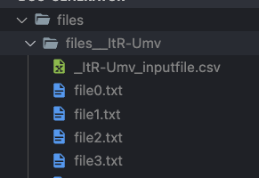

# doc-generator

This is a utility for generating fake training documents and accompanying csv input file

1. Make a .env file in the root of the project and add the following line

```.env
BUCKET_PATH_STRING = "gs://cloud-ai-platform-{{your-bucket-path-here}}";
```

2. Run this command to generate a new set of documents and csv file.

```bash
node docMaker.js
```

The input file and training documents will be written to their own directory, like this:

